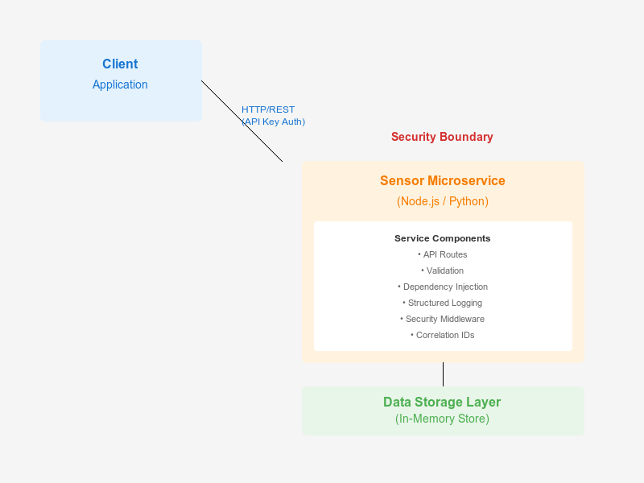

# Assignment 1: Enhanced Sensor Microservice

## Service Definition

The Sensor microservice manages IoT sensor readings for a smart home system. It provides endpoints to create new sensor readings, retrieve individual sensor data by ID, list all sensors, and validate sensor data according to predefined rules. The service handles temperature, humidity, motion, pressure, and light sensor types with proper validation, timestamps, and data persistence. It serves as the central data management layer for sensor readings, ensuring data integrity and providing a consistent API for client applications.

## API Specification

The complete OpenAPI 3.0 specification is available at: [api_spec.yaml](api_spec.yaml)

### Endpoints

- **GET /sensors** - List all sensors with optional filtering and pagination
- **GET /sensors/{sensor_id}** - Get a specific sensor by ID
- **POST /sensors** - Create a new sensor reading (requires API key authentication)

### Security

The POST /sensors endpoint requires Bearer token authentication. Include the API key in the Authorization header:

```
Authorization: Bearer <your-api-key>
```

## Architecture Diagram



The architecture shows:
- **Client Application**: External client making HTTP/REST requests
- **Security Boundary**: API key authentication layer
- **Sensor Microservice**: Service layer with routes, validation, DI, and logging
- **Data Storage Layer**: In-memory storage for sensor data

## Example Requests and Responses

### Create a Sensor (POST /sensors)

**Request:**
```bash
curl -X POST http://localhost:3000/sensors \
  -H "Content-Type: application/json" \
  -H "Authorization: Bearer your-api-key-here" \
  -d '{
    "sensor_id": "temp_kitchen",
    "type": "temperature",
    "value": 68.5,
    "unit": "F"
  }'
```

**Response (201 Created):**
```json
{
  "sensor_id": "temp_kitchen",
  "type": "temperature",
  "value": 68.5,
  "unit": "F",
  "timestamp": "2026-01-18T15:45:00Z"
}
```

### Get All Sensors (GET /sensors)

**Request:**
```bash
curl http://localhost:3000/sensors
```

**Response (200 OK):**
```json
{
  "data": [
    {
      "sensor_id": "temp_living_room",
      "type": "temperature",
      "value": 72.4,
      "unit": "F",
      "timestamp": "2026-01-18T14:30:00Z"
    },
    {
      "sensor_id": "humidity_basement",
      "type": "humidity",
      "value": 45,
      "unit": "%",
      "timestamp": "2026-01-18T14:30:00Z"
    }
  ],
  "count": 2
}
```

### Get Sensor by ID (GET /sensors/{sensor_id})

**Request:**
```bash
curl http://localhost:3000/sensors/temp_living_room
```

**Response (200 OK):**
```json
{
  "sensor_id": "temp_living_room",
  "type": "temperature",
  "value": 72.4,
  "unit": "F",
  "timestamp": "2026-01-18T14:30:00Z"
}
```

### Filter Sensors by Type

**Request:**
```bash
curl "http://localhost:3000/sensors?type=temperature&limit=5"
```

**Response (200 OK):**
```json
{
  "data": [
    {
      "sensor_id": "temp_living_room",
      "type": "temperature",
      "value": 72.4,
      "unit": "F",
      "timestamp": "2026-01-18T14:30:00Z"
    }
  ],
  "count": 1
}
```

### Error Response (401 Unauthorized)

**Request (missing API key):**
```bash
curl -X POST http://localhost:3000/sensors \
  -H "Content-Type: application/json" \
  -d '{"sensor_id": "test", "type": "temperature", "value": 70, "unit": "F"}'
```

**Response (401 Unauthorized):**
```json
{
  "error": "Unauthorized - Invalid or missing API key"
}
```

## Framework Comparison: Dependency Injection and Configuration

### Node.js (Express) Implementation

#### Dependency Injection

Express doesn't have built-in dependency injection, so we use **constructor injection**:

```javascript
// Manual wiring in app.js
const config = new Config();
const logger = new Logger(config);
const repository = new SensorRepository(storage);
const service = new SensorService(repository, logger);
const controller = new SensorController(service, logger);
```

**Approach:**
- Manual dependency wiring at application startup
- Constructor injection pattern
- Dependencies are explicitly passed to constructors
- Easy to test by mocking dependencies

**Example:**
```javascript
class SensorService {
  constructor(repository, logger) {
    this.repository = repository;  // Injected
    this.logger = logger;          // Injected
  }
}
```

#### Configuration Management

**Approach:**
- Environment variables read via `process.env`
- Config class encapsulates all configuration
- Default values provided for development

```javascript
class Config {
  constructor() {
    this.port = parseInt(process.env.PORT || '3000', 10);
    this.apiKey = process.env.API_KEY || 'default-api-key-change-me';
    this.logLevel = process.env.LOG_LEVEL || 'info';
  }
}
```

### Python (FastAPI) Implementation

#### Dependency Injection

FastAPI provides **built-in dependency injection** using the `Depends()` function:

```python
# Automatic dependency resolution
@router.post("/sensors")
async def create_sensor(
    controller: SensorController = Depends(get_sensor_controller),
    _: str = Depends(verify_api_key)
):
    return await controller.create_sensor(request, sensor_data)
```

**Approach:**
- Declarative dependency injection
- FastAPI automatically resolves dependency chains
- Dependencies are functions that return the required objects
- Type hints provide clarity

**Example:**
```python
def get_sensor_service() -> SensorService:
    repository = get_repository()
    logger = get_logger()
    return SensorService(repository, logger)

# Used in route
@router.get("/sensors")
async def get_sensors(service: SensorService = Depends(get_sensor_service)):
    return service.get_all_sensors()
```

#### Configuration Management

**Approach:**
- Environment variables via `os.getenv()`
- Config class similar to Node.js
- Can use Pydantic Settings for advanced validation (not used here for simplicity)

```python
class Config:
    def __init__(self):
        self.port = int(os.getenv('PORT', '8000'))
        self.api_key = os.getenv('API_KEY', 'default-api-key-change-me')
        self.log_level = os.getenv('LOG_LEVEL', 'info')
```

## Trade-offs Observed

### Dependency Injection

**Node.js (Express):**
- ✅ **Pros**: Explicit, easy to understand, full control over wiring
- ❌ **Cons**: Manual setup required, more boilerplate code
- **Best for**: Teams that want explicit control and don't mind manual wiring

**Python (FastAPI):**
- ✅ **Pros**: Built-in, automatic resolution, less boilerplate, type-safe
- ❌ **Cons**: Magic can be harder to debug, requires understanding of DI system
- **Best for**: Teams that want less boilerplate and automatic dependency management

### Configuration

**Both frameworks:**
- Similar approach using environment variables
- Node.js uses `process.env`, Python uses `os.getenv()`
- Both provide sensible defaults
- Both support Docker environment variable injection

### Validation

**Node.js:**
- Manual validation middleware
- More control but more code
- Custom error messages

**Python:**
- Pydantic models provide automatic validation
- Less code, automatic OpenAPI schema generation
- Type-safe with automatic conversion

### Performance

**Node.js:**
- Event-driven, non-blocking I/O
- Excellent for I/O-bound operations
- Single-threaded event loop

**Python (FastAPI):**
- Async/await support
- Good performance with Uvicorn ASGI server
- Can handle concurrent requests well

### Developer Experience

**Node.js:**
- More explicit, easier to debug
- More code to write and maintain
- Familiar to JavaScript developers

**Python:**
- Less boilerplate, more concise
- Automatic API documentation (Swagger UI)
- Type hints improve IDE support

## Running the Services

For detailed run instructions, see [RUN.md](RUN.md).

## Testing

### Node.js Integration Tests

```bash
cd node-service
npm test
```

Tests cover:
- Creating sensors with valid API key
- Fetching sensors by ID
- Data integrity verification
- Error cases (invalid API key, missing fields, duplicates)

### Python Integration Tests

```bash
cd python-service
pytest tests/
```

Tests cover the same scenarios as Node.js tests.

## Project Structure

```
.
├── A1/
│   ├── README.md              # This file
│   ├── RUN.md                 # Run instructions
│   ├── api_spec.yaml          # OpenAPI 3.0 specification
│   └── architecture.png       # Architecture visualization
├── node-service/
│   ├── src/
│   │   ├── index.js          # Entry point
│   │   ├── app.js             # Express app setup
│   │   ├── routes/            # Route definitions
│   │   ├── controllers/       # Request handlers
│   │   ├── services/          # Business logic
│   │   ├── repositories/      # Data access
│   │   ├── middleware/        # Middleware (auth, correlation ID)
│   │   ├── validators/        # Input validation
│   │   └── config/            # Configuration
│   ├── tests/                 # Integration tests
│   ├── package.json
│   └── Dockerfile
├── python-service/
│   ├── src/
│   │   ├── main.py            # Entry point
│   │   ├── app.py             # FastAPI app setup
│   │   ├── routes/            # Route definitions
│   │   ├── controllers/      # Request handlers
│   │   ├── services/          # Business logic
│   │   ├── repositories/     # Data access
│   │   ├── middleware/       # Middleware (auth, correlation ID)
│   │   ├── models/            # Pydantic models
│   │   ├── config/            # Configuration
│   │   └── dependencies.py   # DI setup
│   ├── tests/                 # Integration tests
│   ├── requirements.txt
│   └── Dockerfile
├── docker-compose.yml         # Local development
└── docker-compose.hub.yml     # Docker Hub images
```

## Summary

This assignment demonstrates implementing the same microservice in two different languages with:

- **Consistent API contracts** via OpenAPI specification
- **Dependency injection** using framework-appropriate patterns
- **Structured logging** with correlation IDs
- **Security** via API key authentication
- **Comprehensive testing** with integration tests
- **Docker containerization** for easy deployment

Both implementations are functionally equivalent and follow the same architectural patterns, demonstrating how different frameworks handle similar requirements.
