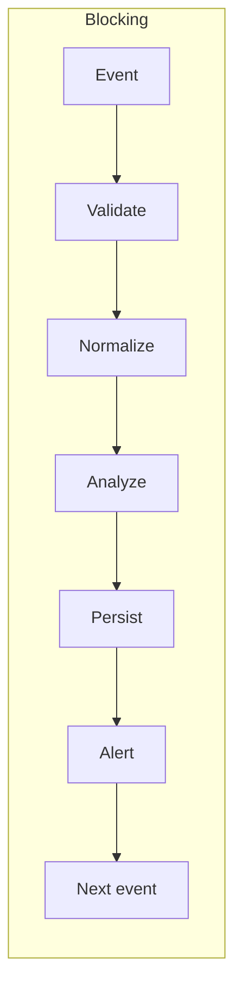
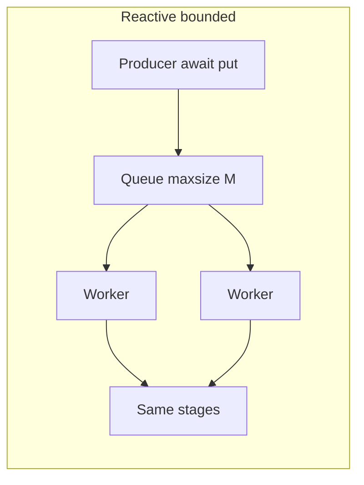
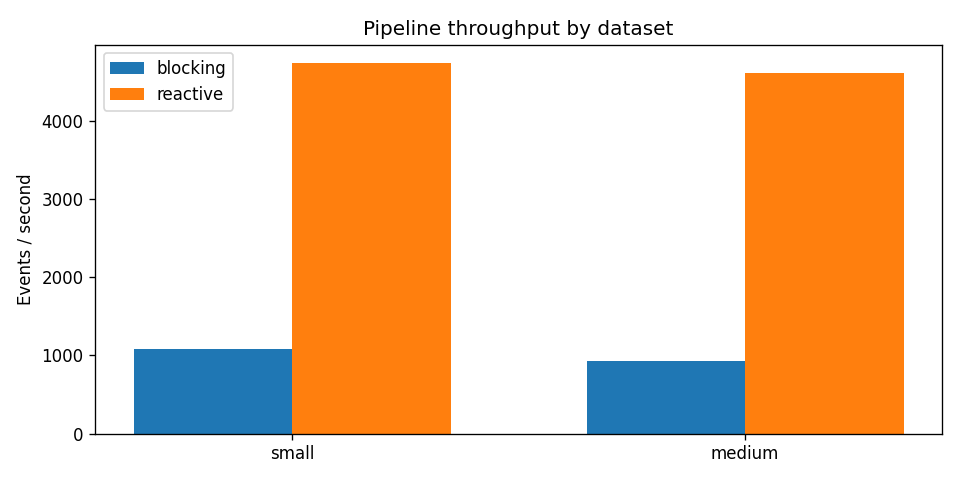
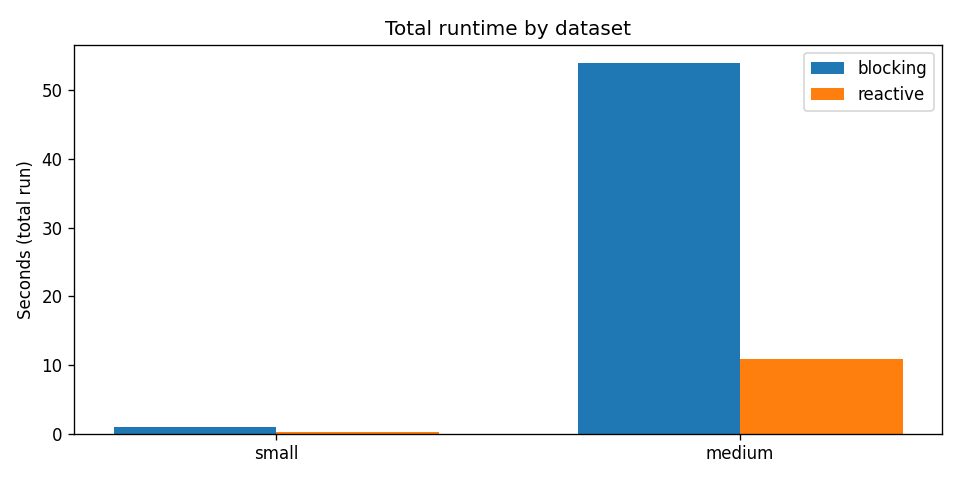
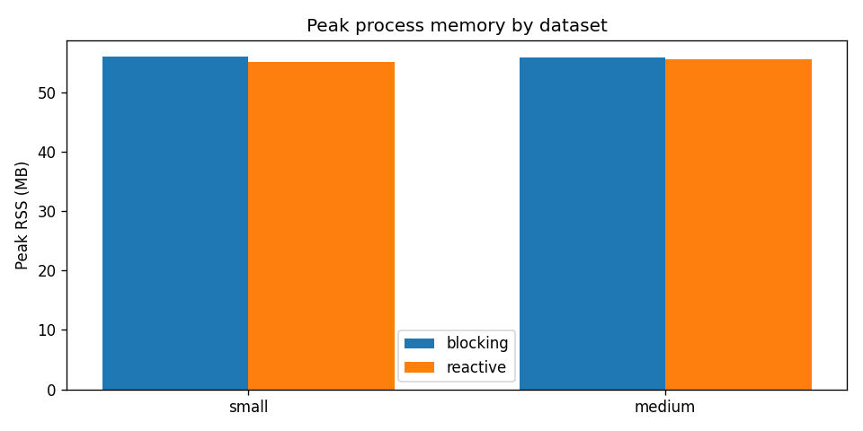

# Assignment 3: Reactive / Async Pipeline & Performance Analysis

## Operational scenario

A tactical command post monitors a contested area where sensors (acoustic, RF, motion, environmental) stream high-volume observations. Operators cannot review every raw reading. The system must **ingest**, **validate**, **normalize**, **score anomalies**, **persist** results, and **surface C2-relevant alerts** when readings exceed policy thresholds. Under surge (coordinated probes, clutter, or swarm-like traffic), processing must stay **bounded** in memory and database load while preserving correctness.

This assignment implements the **same** workload twice in Python:

1. **Blocking pipeline** — one event is carried through all stages before the next begins (`psycopg` synchronous inserts).
2. **Reactive pipeline** — a **producer** feeds a **bounded `asyncio.Queue` (`QUEUE_MAXSIZE=M`)**; a **fixed pool of `WORKER_COUNT` consumer tasks** pulls events and overlaps I/O using **`asyncpg`**. When the queue holds **M** items, `await queue.put(...)` **waits**: that is **backpressure** (intake slows instead of unbounded buffering).

**Experimental objective:** compare throughput, runtime, peak RSS, and error behavior for **small**, **medium**, and **large** datasets under identical inputs and tuning (`M`, `W`), and document observability (structured logs, counters, traces).

---

## Pipeline stages (same logic both modes)

| Stage | Role |
|-------|------|
| **Ingest** | Read one JSON object per line from JSONL |
| **Validate** | Required: `sensor_id`, `timestamp`, `value`, `type` (allowed enum); reject malformed |
| **Normalize** | ISO-8601 timestamp, units, severity label |
| **Analyze** | Deterministic anomaly score in \([0,1]\) from `(type, value)` vs static baselines (no cross-event state — blocking and reactive agree) |
| **Persist** | `INSERT` into Postgres `processed_events` |
| **Alert** | If score ≥ threshold: increment Prometheus counter + count in run summary (`alerts` in CSV / `run_complete` log) |

---

## Architecture diagrams

### Blocking (sequential)



### Reactive (bounded queue + workers)



**Note:** **`M`** is the **buffer** capacity (waiting room). **`WORKER_COUNT` (`W`)** is how many **long-lived** workers consume the queue. They are **independent** (e.g. `M=256`, `W=8`).

---

## Tech stack

| Layer | Choice |
|--------|--------|
| Runtime | Python 3.11 (Docker) |
| Blocking DB | `psycopg` (sync) |
| Reactive DB | `asyncpg` + connection pool |
| Backpressure | `asyncio.Queue(maxsize=M)` only (no `Semaphore` in this codebase) |
| Metrics | `prometheus_client` histograms/counters |
| Logs | JSON lines to stdout (`a3.pipeline` logger) |
| Traces | OpenTelemetry → OTLP gRPC → **Jaeger** (`OTEL_EXPORTER_OTLP_ENDPOINT`) |
| Resource sampling | `psutil` peak RSS during run |
| Charts | `matplotlib` via `scripts/plot_results.py` |

### Architecture decision records

Formal decisions (same style as A2):

- [ADR-001: Bounded queue backpressure](ADRs/001-bounded-queue-backpressure.md)
- [ADR-002: Blocking vs reactive persistence](ADRs/002-blocking-vs-reactive-persistence.md)
- [ADR-003: Observability stack](ADRs/003-observability-stack.md)

---

## Docker services (observability)

| Service | Port(s) | Purpose |
|---------|---------|---------|
| **postgres** | `5436` → 5432 | `a3_pipeline_db` |
| **jaeger** | `16686` (UI), `4317` (OTLP gRPC) | Trace backend |
| **pipeline** | — (batch `docker compose run`) | Build `a3-pipeline:latest`, run CLI |

Primary **graded** path: everything runs **inside containers**; host Python is optional for development only.

---

## Quick start (Docker)

```bash
cd A3

# Infra
docker compose up -d postgres jaeger

# Build pipeline image
docker compose build pipeline

# Generate datasets (JSONL under ./data)
docker compose run --rm --no-deps pipeline \
  python -m pipeline generate --size small --output /app/data/small.jsonl
docker compose run --rm --no-deps pipeline \
  python -m pipeline generate --size medium --output /app/data/medium.jsonl
docker compose run --rm --no-deps pipeline \
  python -m pipeline generate --size large --output /app/data/large.jsonl

# Run pipelines (append rows to ./results/benchmark.csv)
docker compose run --rm \
  -e BENCHMARK_CSV=/app/results/benchmark.csv \
  pipeline python -m pipeline run-blocking --dataset /app/data/small.jsonl

docker compose run --rm \
  -e BENCHMARK_CSV=/app/results/benchmark.csv \
  pipeline python -m pipeline run-reactive --dataset /app/data/small.jsonl

# Charts from CSV
docker compose run --rm --no-deps pipeline \
  python /app/scripts/plot_results.py /app/results/benchmark.csv --out-dir /app/results
```

### Full automated benchmark

```bash
cd A3
bash scripts/benchmark.sh
```

On **Windows**, use **Git Bash** or **WSL** for `benchmark.sh`, or run the `docker compose run` commands above from **PowerShell** in sequence.

### Environment variables

| Variable | Default | Meaning |
|----------|---------|---------|
| `QUEUE_MAXSIZE` | `256` | Bounded queue capacity **M** |
| `WORKER_COUNT` | `8` | Consumer tasks **W** |
| `BENCHMARK_CSV` | `results/benchmark.csv` | Append one row per run |
| `OTEL_EXPORTER_OTLP_ENDPOINT` | (compose: Jaeger) | Set empty to disable OTLP export |
| `OTEL_TRACES_SAMPLE_RATIO` | `1.0` | Fraction of events that emit spans (use `0.01`–`0.05` for **large** runs) |

---

## Performance results (sample)

Rows appended to [`results/benchmark.csv`](results/benchmark.csv). **Large** dataset (`150_000` lines) is generated by the same script; run locally and add rows before final submission. The table below matches a representative run on the author’s machine (Docker Desktop, SSD). **Alert counts** for medium are proportional to the small run (same generator seed and scoring).

| dataset | mode | event_count | duration_s | events/s | peak_rss_mb | errors | alerts |
|---------|------|-------------|------------|----------|-------------|--------|--------|
| small | blocking | 1000 | 0.92 | 1082 | 56 | 0 | 305 |
| small | reactive | 1000 | 0.21 | 4742 | 55 | 0 | 305 |
| medium | blocking | 50000 | 53.9 | 927 | 56 | 0 | 15250 |
| medium | reactive | 50000 | 10.8 | 4613 | 56 | 0 | 15250 |

### Charts (matplotlib)







Regenerate after editing CSV:

```bash
docker compose run --rm --no-deps pipeline \
  python /app/scripts/plot_results.py /app/results/benchmark.csv --out-dir /app/results
```

---

## Analysis (findings)

### When async / reactive helps

The **persist** stage waits on PostgreSQL. In the **blocking** implementation, the process sits idle on each `INSERT` while no other event advances. In the **reactive** design, **up to `W` workers** can be waiting on the database at once, so **wall-clock throughput** rises when the workload is **I/O bound**, as shown by the **~5×** runtime reduction for the **medium** dataset in the sample table. Overlapping waits is exactly the “TOC cell continues working while one member is on the phone” mental model.

### When it complicates operations

**Ordering and debugging:** concurrent workers interleave logs; correlation still uses `event_id` / `correlation_id`, but traces must be sampled (`OTEL_TRACES_SAMPLE_RATIO`) on large runs to avoid exporter overload. **Tail latency** for individual events can grow if the queue is deep: events may wait in the buffer even though aggregate throughput is higher. **Configuration coupling:** `WORKER_COUNT` should stay aligned with the **asyncpg pool** size so you do not spawn more concurrent DB users than the pool allows.

### Resilience and backpressure

**Backpressure** here is explicit: the producer **blocks on `put`** when **M** slots are full. That caps memory growth from the ingress side compared to “schedule every row with `gather`.” Under **DB slowdown**, the queue fills; the producer slows; the system **degrades by adding latency**, not by exhausting RAM or opening unbounded connections. Failure modes to monitor: **pool exhaustion** (raise pool or lower `W`), **validation error spikes** (bad upstream data), and **OTLP backpressure** (sample traces).

### Apples-to-apples checklist

- Same JSONL file per mode  
- Same `QUEUE_MAXSIZE` and `WORKER_COUNT` for reactive comparisons  
- Same Postgres container and volume class  
- Document hardware (CPU, Docker Desktop vs Linux host)

---

## Observability evidence (assignment checklist)

1. **Structured logs** — JSON lines with `run_complete`, `validation_failed`, `db_error`; fields include `mode`, `dataset`, `duration_s`, `events_per_s`, `alerts_raised`.  
2. **Metrics** — Prometheus metrics named `a3_pipeline_*` (counters + stage histogram).  
3. **Traces** — OpenTelemetry spans: `validate`, `normalize`, `analyze`, `persist`, `alert`.  

**Jaeger UI:** open `http://localhost:16686` after `docker compose up -d jaeger`, service `a3-pipeline-blocking` or `a3-pipeline-reactive`. Capture a screenshot of a trace covering all stages for the write-up.

**Screenshot placeholders (add your captures):**

- `docs/screenshots/log-run-complete.png` — one `run_complete` line  
- `docs/screenshots/jaeger-trace.png` — waterfall across stages  

---

## Project layout

```
A3/
├── ADRs/
│   ├── 001-bounded-queue-backpressure.md
│   ├── 002-blocking-vs-reactive-persistence.md
│   └── 003-observability-stack.md
├── docker-compose.yml
├── Dockerfile
├── requirements.txt
├── pipeline/
│   ├── __main__.py          # CLI: generate, run-blocking, run-reactive
│   ├── config.py
│   ├── dataset_gen.py
│   ├── stages.py
│   ├── db.py
│   ├── observability.py
│   ├── blocking_runner.py
│   └── reactive_runner.py
├── scripts/
│   ├── benchmark.sh
│   ├── generate_dataset.py
│   └── plot_results.py
├── data/                    # generated JSONL (gitignored large files optional)
└── results/                 # benchmark.csv, *.png, summaries
```

---

## Grading rubric mapping

| Criterion | Evidence in this repo |
|-----------|------------------------|
| Correct pipelines | `blocking_runner.py` vs `reactive_runner.py`, shared `stages.py` |
| Backpressure / async | Bounded `asyncio.Queue`, documented `M` / `W`, asyncpg pool; [ADR-001](ADRs/001-bounded-queue-backpressure.md) |
| Load testing | `benchmark.sh`, three dataset sizes, CSV + charts |
| Analysis | This README (sections above) |
| Observability | JSON logs, Prometheus metrics, OTel + Jaeger |

---

## References

- [OpenTelemetry Python](https://opentelemetry.io/docs/languages/python/)  
- [Jaeger OTLP](https://www.jaegertracing.io/docs/latest/apis/#opentelemetry-protocol-stable)  
- [asyncio queues](https://docs.python.org/3/library/asyncio-queue.html)  
